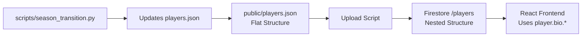

# 🔍 Pipeline and Bio Data Structure Explanation

## Why the Pipeline Doesn't Work in GitHub Actions

### 🚫 Current GitHub Actions Workflow
The current `.github/workflows/audit.yml` workflow only runs:
```yaml
- run: npm ci
- run: npm run test -- --run
```

**It does NOT run the data pipeline because:**

1. **Missing Firebase Credentials**: The pipeline requires `serviceAccountKey.json` which contains sensitive Firebase admin credentials that cannot be stored in public repositories
2. **Security Isolation**: GitHub Actions runners are isolated environments that don't have access to your local Firebase credentials
3. **Design Intent**: The pipeline is designed for local development and manual deployment, not automated CI/CD

### 🔧 What Would Be Needed for Pipeline in CI

To run the pipeline in GitHub Actions, you would need:

```yaml
# This is NOT recommended for security reasons
- name: Setup Firebase Credentials
  env:
    FIREBASE_SERVICE_ACCOUNT: ${{ secrets.FIREBASE_SERVICE_ACCOUNT }}
  run: echo "$FIREBASE_SERVICE_ACCOUNT" > serviceAccountKey.json

- name: Run Season Transition
  run: npm run season:transition
```

**But this is NOT implemented because:**
- It would expose sensitive Firebase admin credentials
- The pipeline is intended for manual, controlled execution
- Data uploads should be deliberately triggered, not automatic

---

## Why Bio and Contracts Are Separate When Bio Is Already in players.json

### 📊 Data Structure Transformation

The confusion comes from **different data structures** for different purposes:

#### Local Structure (`public/players.json`)
```json
{
  "precious_achiuwa": {
    "Name": "Precious Achiuwa",
    "HT": "6-8",           // ← Bio field at root level
    "WT": "243",           // ← Bio field at root level  
    "AGE": 25,             // ← Bio field at root level
    "Team": "Knicks",      // ← Bio field at root level
    "Position": "Forward", // ← Bio field at root level
    "Contract": "$6.0M / 1 yr", // ← Contract at root level
    "PPG": 6.6,            // ← Stats at root level
    "overall_grade": "B+"  // ← Grades at root level
  }
}
```

#### Firestore Structure (After Upload)
```json
{
  "precious_achiuwa": {
    "bio": {               // ← Bio nested under 'bio' object
      "Name": "Precious Achiuwa",
      "HT": "6-8",
      "WT": "243", 
      "AGE": 25,
      "Team": "Knicks",
      "Position": "Forward",
      "Contract": "$6.0M / 1 yr",
      "Free Agent": "2025 (UFA)"
    },
    "overall_grade": "B+", // ← Grades remain at root level
    "last_bio_update": "2025-01-01T12:00:00Z"
  }
}
```

### 🔄 Why This Transformation Happens

1. **Data Organization**: Firestore structure separates concerns - bio data vs grades vs stats
2. **API Consistency**: Frontend components expect `player.bio.Team` not `player.Team`
3. **Update Tracking**: Allows tracking when bio data was last updated vs other data
4. **Preservation**: Ensures existing grades and other data aren't overwritten during bio updates

### 📝 What the Upload Script Actually Does

The `push_bio_and_contract.py` script:

1. **Reads** flat structure from `public/players.json`
2. **Extracts** bio fields: `["AGE", "HT", "WT", "Team", "Position", "Years Pro", "Contract", "Free Agent"]`
3. **Creates** nested `bio` object in Firestore
4. **Preserves** existing grades and other data that's already in Firestore
5. **Updates** with merge=True to avoid overwriting non-bio data

---

## The Complete Data Flow



### Local Development Flow
1. **Source**: `public/players.json` (flat structure)
2. **Process**: Upload scripts transform to nested structure  
3. **Destination**: Firestore (nested `bio` object)
4. **Consumption**: React app reads from Firestore

### Why Not Store Nested Locally?
- **Simplicity**: Flat structure is easier to edit and maintain
- **Legacy**: Existing scripts expect flat structure
- **Flexibility**: Allows different output formats for different targets

---

## Testing the Transformation Locally

You can see exactly what the bio upload does without Firebase credentials:

```bash
# Demo the transformation process
python3 scripts/demo_bio_transformation.py

# Test the upload logic without actually uploading
python3 scripts/upload_bio_solution.py --test
```

These show the flat-to-nested transformation process without requiring Firebase setup.

---

## Summary

| Question | Answer |
|----------|--------|
| **Why no pipeline in CI?** | Requires Firebase credentials that can't be safely stored in public repos |
| **Why separate bio upload?** | Transforms flat local structure to nested Firestore structure |
| **Is bio data duplicated?** | No - it's the same data in different formats for different purposes |
| **Can I run pipeline locally?** | Yes, with `serviceAccountKey.json` in project root or src/ |

### Quick Demo
```bash
# See the actual transformation
python3 scripts/demo_bio_transformation.py
```

The system is designed for **local development with manual deployment**, not automated CI/CD pipelines.

For detailed explanations, see:
- [CI Pipeline Limitations](CI_PIPELINE_LIMITATIONS.md) - Why CI doesn't run the pipeline
- [Data Source Map](docs/DATA_SOURCE_MAP.md) - Firestore structure details