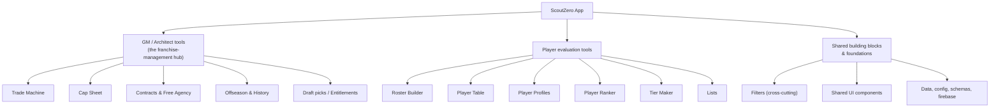

# ScoutZero — Codebase Map (plain-language)

**What this is:** a non-coder's map of the app. For each thing you see on screen, it tells you what it's called in the code and where it lives — so you can point agents at the right place, use precise words, and orient yourself when brainstorming.

**Status:** V1 — verified. Paths, screens, and area descriptions checked against the actual code (`src/pages/`, `src/features/`, and the Architect feature README). Refine further as areas get deep-audited.

---

## How to use this map (read once)

- **This is a table of contents, not the whole book.** Each entry names a **folder** (the area) and a few **landmark files** so *you* recognize what's there. It does **not** list every file — and it doesn't need to.
- **Listing only landmarks does NOT limit an audit or task.** When you tell an agent "audit/work on the Trade Machine," it reads the **whole folder** and follows every file connected to it — not just the landmarks named here. The map orients *you*; the *folder* defines the scope. (Think: a chapter listed as "p.120" still gets read in full — the page number just helps you find it.)
- **To scope a request:** copy the "Lives in" path into your ask, e.g. *"Audit the Roster Builder in `src/features/roster/`."*
- **Don't know which area?** Tell the agent the screen or what you were doing ("the page where I build a team's roster") and ask it to find the area first.
- **Altitude on purpose:** this maps *areas + landmarks*, not every file. That's what keeps it readable and slow to go stale.

---

## The big picture (orientation diagram)

> Renders in VS Code's Markdown preview. If it shows as text, install the "Markdown Preview Mermaid Support" extension.

---

## Area entries

Each entry: **what you see / call it → code name → where it lives → what's inside.**

---

### 🏀 GM / Architect tools — the franchise-management hub

The umbrella for everything "running a team": trades, the cap sheet, contracts, free agency, offseason, history, compare, draft picks. Almost all of it lives under one feature folder, and the **GM Dashboard** is the screen that stitches the rooms together.

- **Code name:** `architect` (a.k.a. "GM mode" / "The Architect")
- **Lives in:** `src/features/architect/`
- **Two entry screens:**
  - **GM Dashboard** (the main team workspace) — URL `/gm/:teamId` → `src/pages/GmDashboardView.tsx` → `src/features/architect/GMDashboard/GMDashboard.tsx`
  - **Architect League View** (league entry view) — URL `/gm` → `src/pages/GmLeagueView.tsx` → `src/features/architect/shared/LeagueView/LeagueView.tsx`
- **Overview doc already in repo:** `src/features/architect/ARCHITECT_FEATURE_README.md` (worth a skim — it's the authoritative "where does X live" for GM mode)
- **How the dashboard is built:** `GMDashboard.tsx` composes "rooms" as **sections** in `src/features/architect/GMDashboard/sections/` (e.g. `CapSheetSection.tsx`, `FreeAgencySection.tsx`, `OffseasonSection.tsx`). Each room's actual guts live in its own folder below. The default/home room is **"Full Cap Table."**
- **Sub-areas (rooms) inside it:**

#### • Trade Machine *(worked example — this is what "depth" looks like)*
*The screen where you build a trade between teams and check if it's legal.*
- **Lives in:** `src/features/architect/tradeMachine/` (the visible UI — team cards, salary calculator, validation panel, preview/export image)
- **The brain (rules & validation logic):** `src/features/architect/hooks/useTradeMachine*` and `src/features/architect/utils/tradeMachine/`
- **Landmark files:** `TradeEditor.tsx` (the whole screen), `TradeTeamCard.tsx` (one team's column), `TradeSalaryCalculator.tsx`, `ValidationDetailsPanel.tsx`, `TradePreviewModal.tsx`
- **Already-written plan for it:** `docs/architect/audits/TM_UI_SURFACE_CLEANUP_SPEC_V1.md`
- *Note how this entry has more layers (UI vs "brain" vs landmarks). Most entries don't need that much — the Trade Machine gets it because we've been deep in it.*

#### • Cap Sheet / Full Cap Table  *(the GM home base)*
*The dense team salary/cap table — what each team pays per season and where they sit vs the cap and aprons. This is the default room.*
- **Lives in:** `src/features/architect/capSheet/`
- **Landmark files:** `capSheet/CapSheetFull/CapSheetFull.tsx` (the dense home-base table), `capSheet/CapSheet/CapSheet.tsx`, section wrapper `GMDashboard/sections/CapSheetSection.tsx`
- **The brain (cap math):** `computeTeamCapTotals.ts` is the canonical source for team cap totals (used here, by the Trade Machine, and league views).

#### • Contracts & Free Agency
*Editing contracts; signing/renouncing free agents (the "FA Options" shortlist on the desk).*
- **Lives in:** `src/features/architect/contract/` and `src/features/architect/freeAgency/` (UI guts: `freeAgency/FreeAgentPool/`)
- **Section wrapper:** `GMDashboard/sections/FreeAgencySection.tsx`
- **Landmark:** the contract-editing modal is **shared** — `src/shared/components/EditContractModal` (the Trade Machine uses the same one).

#### • Offseason & History
*Advancing seasons (Offseason), and the record of past moves/events (Team History).*
- **Lives in:** `src/features/architect/offseason/` (UI: `offseason/OffseasonTab/`) and `src/features/architect/history/` (UI: `history/TeamHistoryTab/`)
- **Section wrappers:** `GMDashboard/sections/OffseasonSection.tsx`, and the history/compare sections.

#### • Compare & Guide
*"Compare" diffs teams/scenarios; "Guide" answers guided GM questions.*
- **Lives in:** `src/features/architect/comparison/` and `src/features/architect/guidedQuestions/` (mostly logic — view models, catalogs).

#### • Draft picks / Entitlements
*Owning, trading, and protecting future draft picks ("entitlements").*
- **Lives in:** `src/features/architect/utils/entitlements/` (logic) + pick UI inside `tradeMachine/` (EntitlementPicksList, EntitlementPickRow) and `src/features/architect/admin/` (the pick editor wizard).

#### • Other GM pieces
- **GM Dashboard shell:** `src/features/architect/GMDashboard/` · **Cockpit/overlays:** `cockpit/` · **Player comparison:** `comparison/` · **Guided questions:** `guidedQuestions/` · **Admin tools:** `admin/`

---

### 📋 Roster Builder
*The standalone page where you build/edit a team's roster, then export or save it.*
- **Code name:** `roster`
- **Lives in:** `src/features/roster/`
- **Screen(s):** `src/pages/TeamRosterView.tsx` (→ `RosterViewer.tsx`), `src/pages/RostersHome.tsx` (the saved-rosters list)
- **Landmark files:** `RosterViewer.tsx` (the page), `RosterViewerActions.tsx`, `AddPlayerDrawer/`, `RosterSection/`, plus export/save modals (`RosterExportModal.tsx`, `SaveRosterModal.tsx`).
- **⚠️ Don't confuse with:** the **roster *section* inside the GM Dashboard** (part of `architect`). This `features/roster/` is the *standalone* roster-building tool; the GM Dashboard has its own roster room for managing a team in GM mode. If you mean one specifically, say "the standalone Roster Builder" vs "the GM Dashboard roster."

---

### 📊 Player Table
*The big sortable/filterable table of players.*
- **Code name:** `table` / "PlayerTable"
- **Lives in:** `src/features/table/` (main part: `src/features/table/PlayerTable/`)
- **Screen:** `src/pages/PlayerTableView.tsx` (→ `PlayerTable`)
- **Landmark files:** `PlayerTable/index.tsx`, `PlayerTable/PlayerRow/`, `PlayerTable/PlayerTableHeader/`
- **Works with:** Filters (below).

---

### 👤 Player Profiles
*A single player's detail page — header/bio, stats, roles, traits, badges, with navigation between players and auto-save of edits.*
- **Code name:** `profile`
- **Lives in:** `src/features/profile/`
- **Screen:** `src/pages/PlayerProfileView.tsx`
- **Landmark files:** `PlayerDetails/` (the body — `PlayerHeader/`, `PlayerStatsTable.tsx`, `PlayerTraitsGrid.tsx`, `PlayerRolesSection/`, `BadgeSelector.tsx`), `PlayerNavigation.tsx`, and hooks `usePlayerProfileState` / `useAutoSavePlayer`.

---

### 🥇 Player Ranker
*The tool for ranking players via head-to-head comparisons.*
- **Code name:** `ranker`
- **Lives in:** `src/features/ranker/`
- **Screen:** `src/pages/PlayerRankerPage.tsx` (→ `RankingBuilder.tsx`)
- **Landmark files:** `RankingBuilder.tsx` (the orchestrator), `RankingSetup.tsx`, `RankingSession.tsx`, `ComparisonMatrix.tsx`, `RankingResults.tsx`.

---

### 🪜 Tier Maker
*Drag-and-drop tier lists (S/A/B-tier boards). Has two board modes: the standard **Tier Maker** board and a **Tieramid** (pyramid) board.*
- **Code name:** `tierMaker`
- **Lives in:** `src/features/tierMaker/`
- **Screen(s):** `src/pages/TierMakerView.tsx` (the editor — switches between `TierMakerBoard.tsx` and `TieramidBoard.tsx`), `src/pages/TierListsHome.tsx` (saved tier lists)
- **Landmark files:** `TierMakerBoard.tsx`, `TierRow.tsx`, `TieramidBoard.tsx`/`TieramidPool.tsx`, `hooks/useTierDraft.ts`.

---

### 🗂️ Lists
*Custom player lists — create, rank, style, export, share.*
- **Code name:** `lists`
- **Lives in:** `src/features/lists/`
- **Screen(s):** `src/pages/ListsHome.tsx`, `src/pages/ListManager.tsx`

---

### 🔎 Filters *(cross-cutting — not its own screen)*
*The filtering controls used by the Player Table and Lists.*
- **Code name:** `filters`
- **Lives in:** `src/features/filters/`
- **Why it's separate:** it's shared machinery several screens reuse, so it lives on its own.

---

### 🧱 Shared building blocks
*Reusable UI pieces used all over (logos, dropdowns, modals, buttons).*
- **Lives in:** `src/shared/` (especially `src/shared/components/`) and `src/components/`
- **Examples you'll hear named:** `TeamLogo`, `TeamSelectDropdown`, `EditContractModal`.
- **When this matters:** if a fix touches one of these, it can affect *many* screens at once — worth flagging in any request.

---

### ⚙️ Foundations / plumbing *(rarely what you point at, but good to know)*
- **App entry & routing:** `src/App.tsx`, `src/main.tsx`, `src/pages/` (each page = one screen)
- **Settings & constants:** `src/config/`, `src/constants/`
- **Data shapes / validation schemas:** `src/schemas/`, `src/types/`
- **Raw data & loaders:** `src/data/`, `src/core/`
- **Backend / auth:** `src/firebase/`, `src/firebaseConfig.ts`
- **Tests:** `tests/` and `src/tests/` (the app has heavy test coverage — see `AGENTS.md` for which test command matches which area)

---

## Vocabulary cheat-sheet (plain word → code word)

| When you say… | The code calls it… | Found in… |
|---|---|---|
| "the trade screen / trade builder" | Trade Machine / `tradeMachine` / TradeEditor | `src/features/architect/tradeMachine/` |
| "the cap / salary page" | Cap Sheet / `capSheet` | `src/features/architect/capSheet/` |
| "GM mode / managing a team" | architect | `src/features/architect/` |
| "draft picks / protected picks" | entitlements | `src/features/architect/utils/entitlements/` |
| "the roster page" | roster | `src/features/roster/` |
| "the player spreadsheet/table" | PlayerTable / `table` | `src/features/table/` |
| "a player's page" | profile | `src/features/profile/` |
| "the ranking tool" | ranker | `src/features/ranker/` |
| "tier list maker" | tierMaker | `src/features/tierMaker/` |
| "a screen / page" | a "view" or "page" | `src/pages/*View.tsx` |
| "a reused button/dropdown/popup" | a shared component | `src/shared/components/` |
| "the rules/logic behind X" | hooks + utils | `.../hooks/` and `.../utils/` |

---

## Keeping this fresh

Code moves; this will drift. It doesn't need to be perfect — just roughly right. To refresh it, ask an agent:
> Update `docs/CODEBASE_MAP.md` to match the current structure — check `src/features/` and `src/pages/`, add anything new, fix anything that moved. Keep it at the area + landmark altitude; don't list every file.

To go deeper on any single area later:
> Make a drill-down map for [area] like the Trade Machine entry — its main screen parts, where the logic lives, and the landmark files. Add it as a new section or its own doc.
